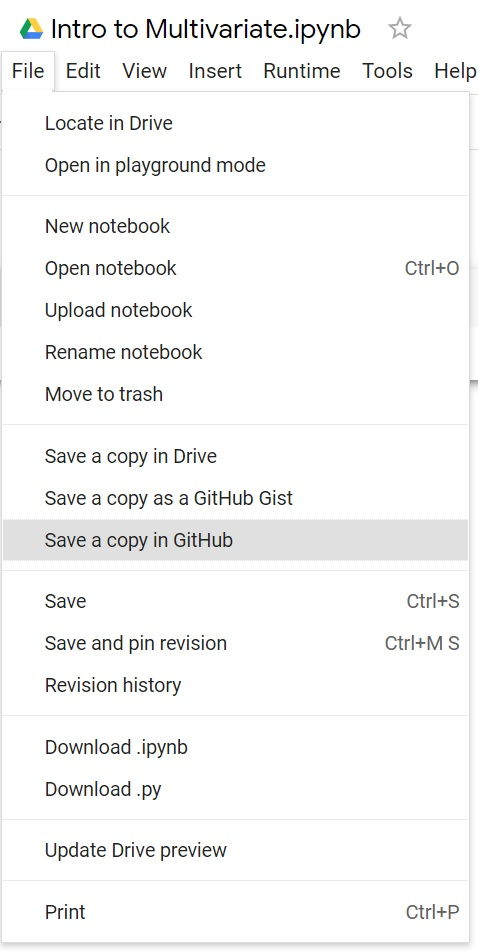
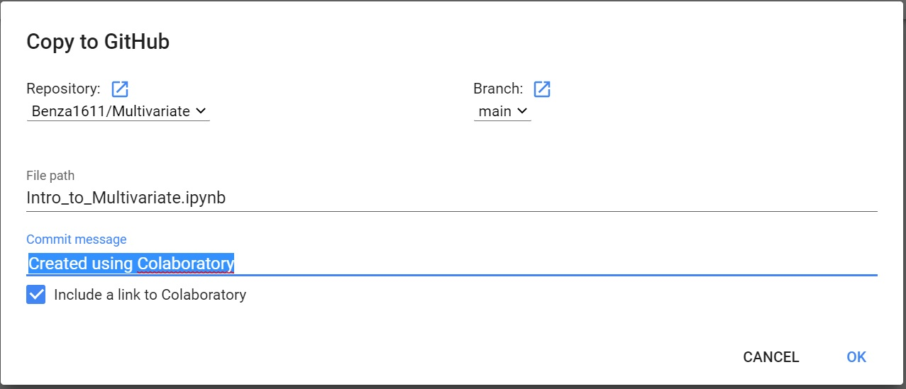

# Multivariate

## นางสาวเบญญาภา ระภูเขียว 623020527-6

. md => Markdown

### อธิบายการใช้งาน Github และ Google Colab ว่าหน้าที่แต่ละอันคืออะไร และอธิบายวิธีการเซฟไฟล์ จาก Google colab ลงใน Github

Github ใช้ในการเก็บข้อมูล ไม่ว่าจะเป็นการเขียนโค้ดpython Textข้อความ ที่เซฟมาจากGoogle Colab

Google Colab ใช้ในการเขียนโค้ด python หรือพิมพ์ข้อความ ในรูปแบบออนไลน์ 

### วิธีการเซฟไฟล์จาก Google Colab ไปที่ Github

1.เปิดหน้าไฟล์ที่ต้องการเซฟ 

2.เลือกไปที่ File

3.เลือก Save a copy in Github

4.เลือก Repository 

5.ใส่รายละเอียด Commit message

6.กด OK
